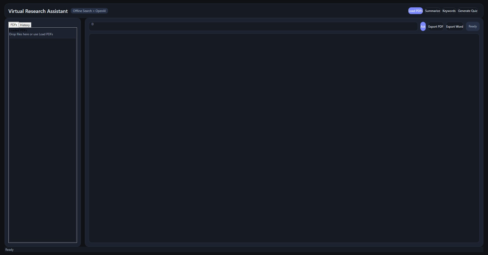
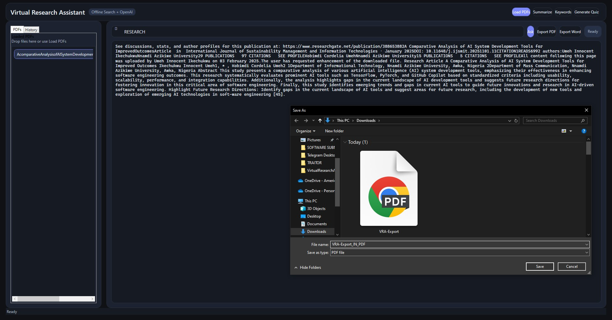
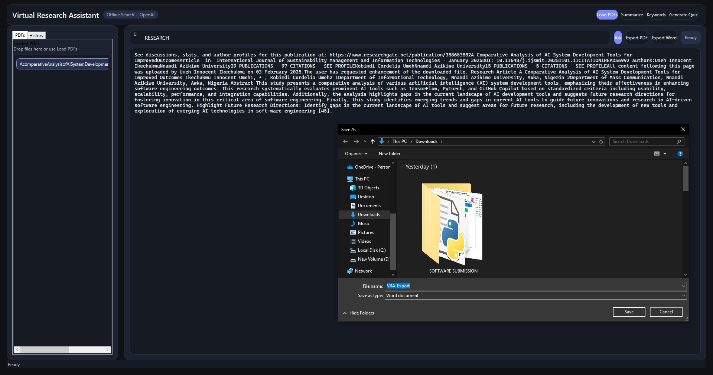
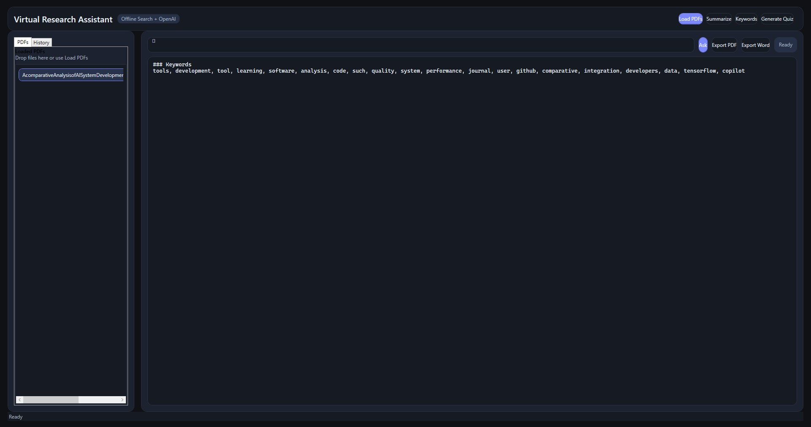
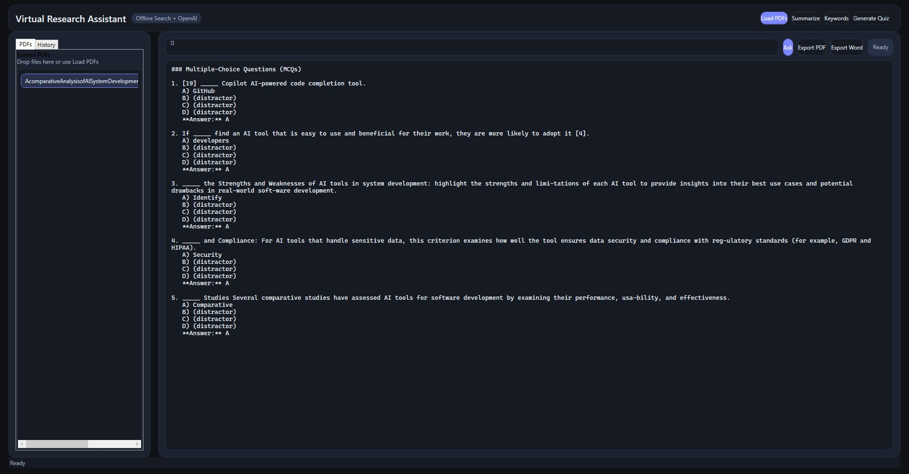
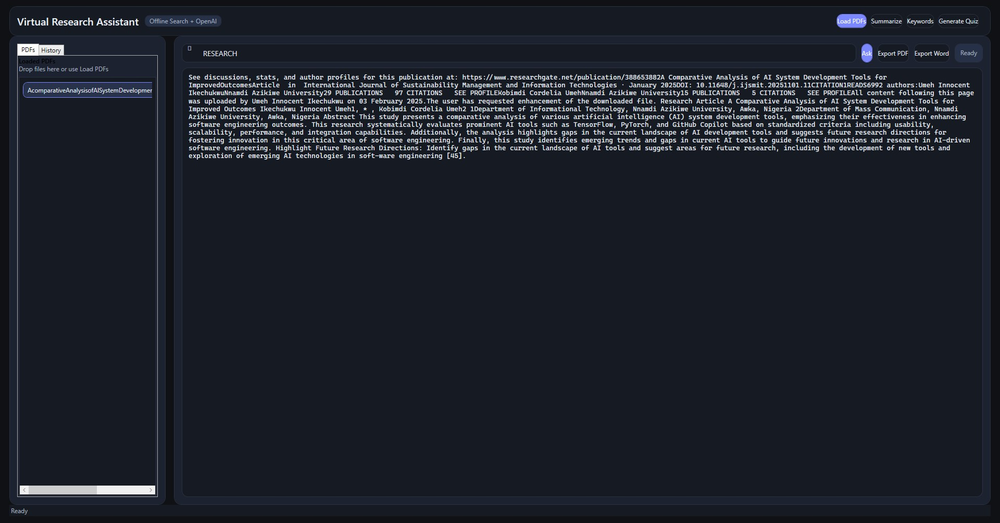
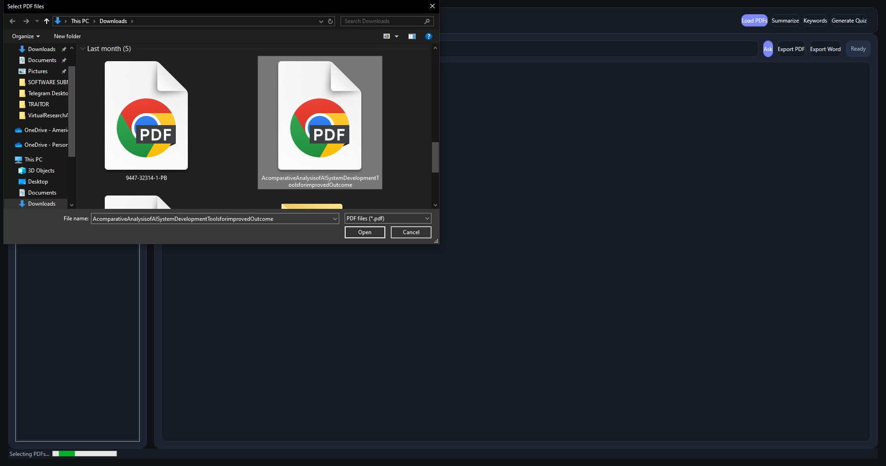
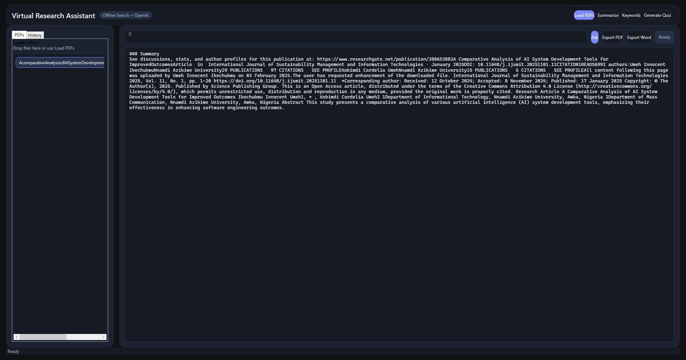

📘 Virtual Research Assistant

A desktop-based Virtual Research Assistant built with C# WPF.
This application helps researchers interact with PDFs, generate summaries, extract keywords, create quizzes, and export results to PDF/Word documents.

✨ Features

📂 Load PDFs – Import one or more research papers or documents.

📝 Summarize Content – Quickly generate an abstract-style summary.

🔑 Keyword Extraction – Extract the most relevant keywords from the text.

❓ Quiz Generator – Create multiple-choice questions (MCQs) from content.

🔍 Search & Ask – Ask direct questions and retrieve answers from the document.

📜 History Tracking – Keeps a record of all your actions (summaries, questions, exports).

📤 Export Options – Save outputs as PDF or Word.

⚡ Fast & Offline – Works locally without requiring internet.

## Screenshots

### 🖥️ Dashboard

### 📄 Export to PDF

### 📝 Export to Word

### 🔑 Keywords Extraction

### 🎯 Quizzes Generation

### 🔍 Search Bar

### 📑 Searching Documents

### ✨ Summarization

⚙️ Installation & Setup
🔹 Prerequisites

Windows 10/11

Visual Studio 2022 (with .NET Desktop Development workload)

.NET 6.0 SDK or later

🔹 Steps to Run

Clone this repository:
git clone https://github.com/Shahriyarrrrr/VirtualResearchAssistant.git
cd VirtualResearchAssistant
Open the solution in Visual Studio 2022.

Build the project (Ctrl+Shift+B).

Run the application (F5).

📂 Project Structure
VirtualResearchAssistant/
│── VirtualResearchAssistant.sln   # Solution file
│── MainWindow.xaml                # UI layout
│── MainWindow.xaml.cs             # Core logic
│── Services/                      # PDF text extraction service
│── Assets/                        # Images, icons
│── screenshots/                   # Screenshots for README
│── bin/ & obj/                    # Build artifacts

📜 Usage

Load PDFs → Click Load PDFs and select your files.

Summarize → Press Summarize to get a short summary.

Extract Keywords → Press Keywords to generate important terms.

Generate Quiz → Press Generate Quiz to build practice questions.

Ask Questions → Type your query in the search bar → press Ask.

Export → Save results in PDF/Word format using export buttons.

🛠️ Technologies Used

C# (WPF) – UI and application logic

QuestPDF – PDF export

OpenXML SDK – Word export

Regex/NLP (Lightweight) – Summarization, keyword extraction, quiz generation

📄 License

This project is licensed under the MIT License – see LICENSE
 file for details.
🤝 Contributing

Pull requests are welcome.
If you’d like to improve features, optimize code, or add new functionalities:

Fork the repo

Create your feature branch (git checkout -b feature/new-feature)

Commit changes (git commit -m "Add new feature")

Push branch (git push origin feature/new-feature)

Open a Pull Request

🙌 Author

👤 Shahriyarrrrr
https://github.com/Shahriyarrrrr
 

